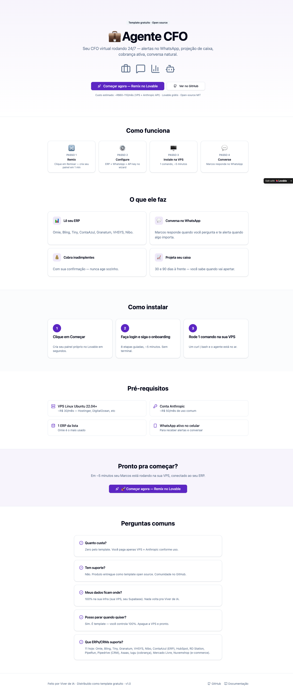
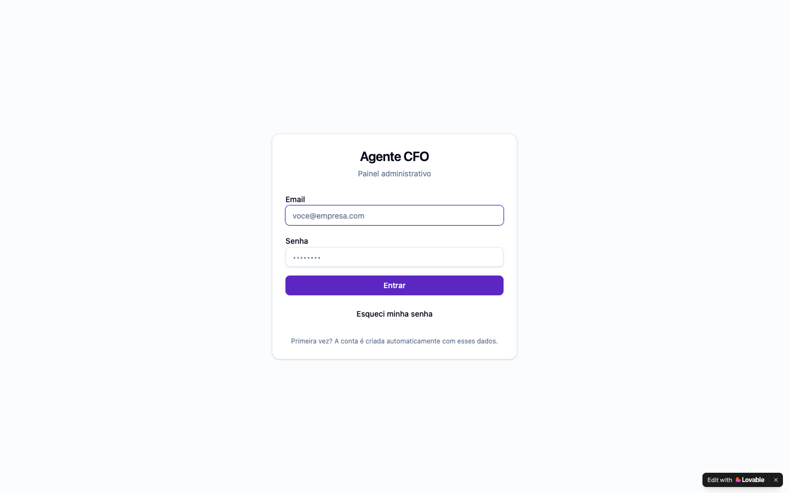
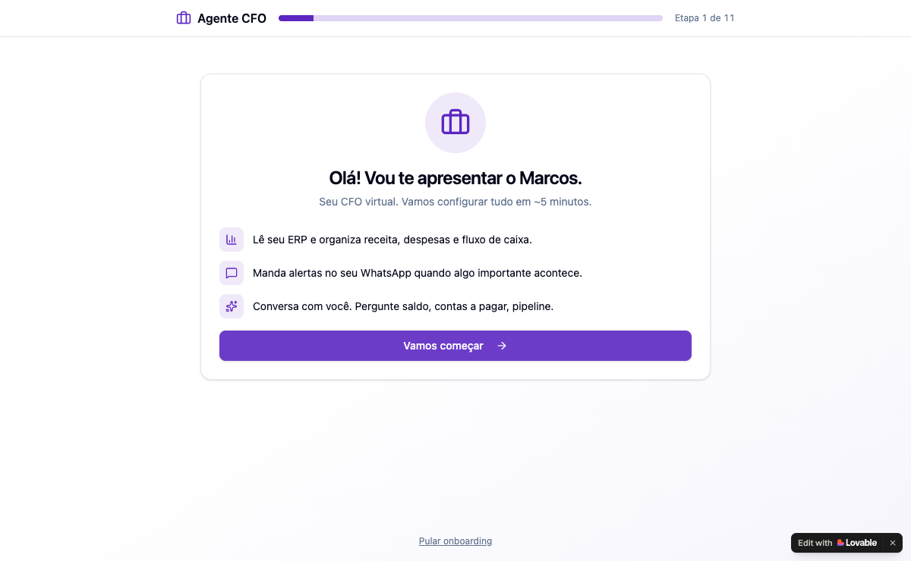
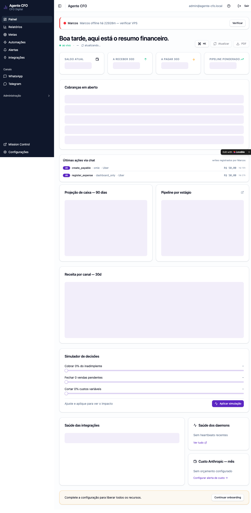
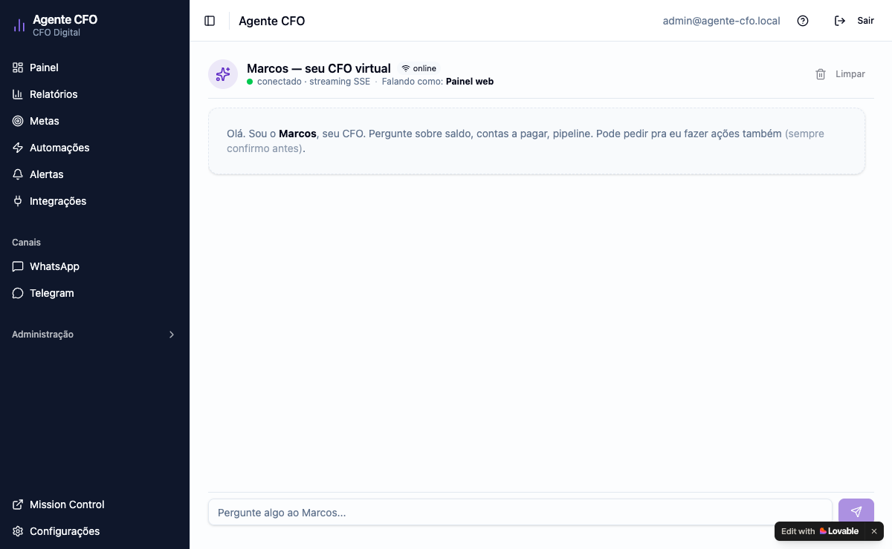
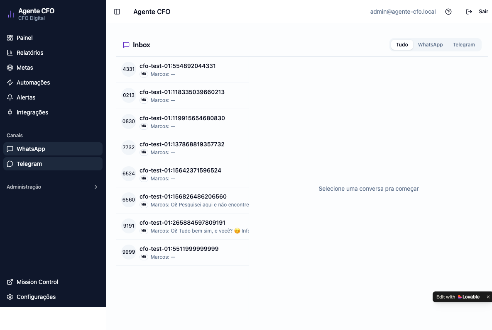
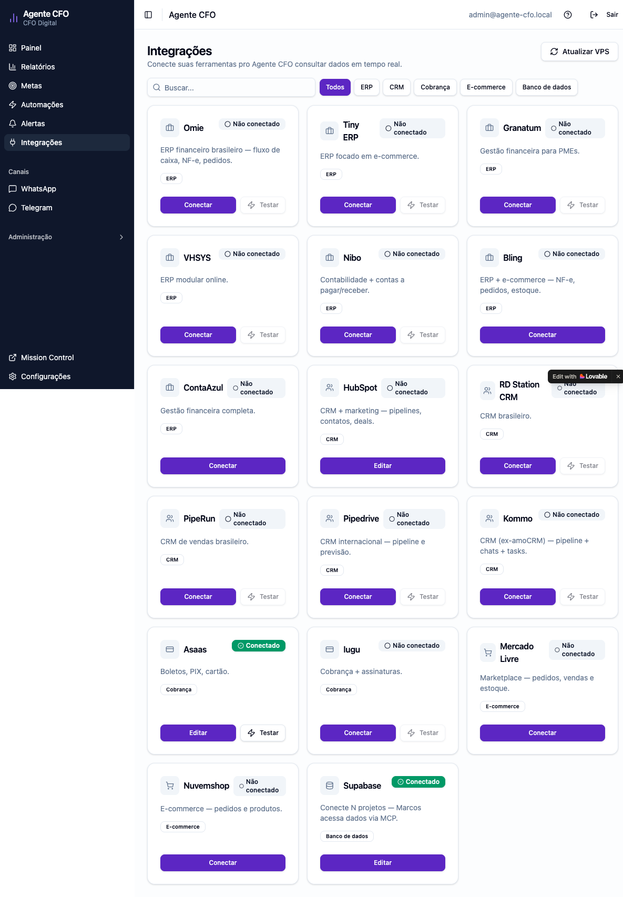
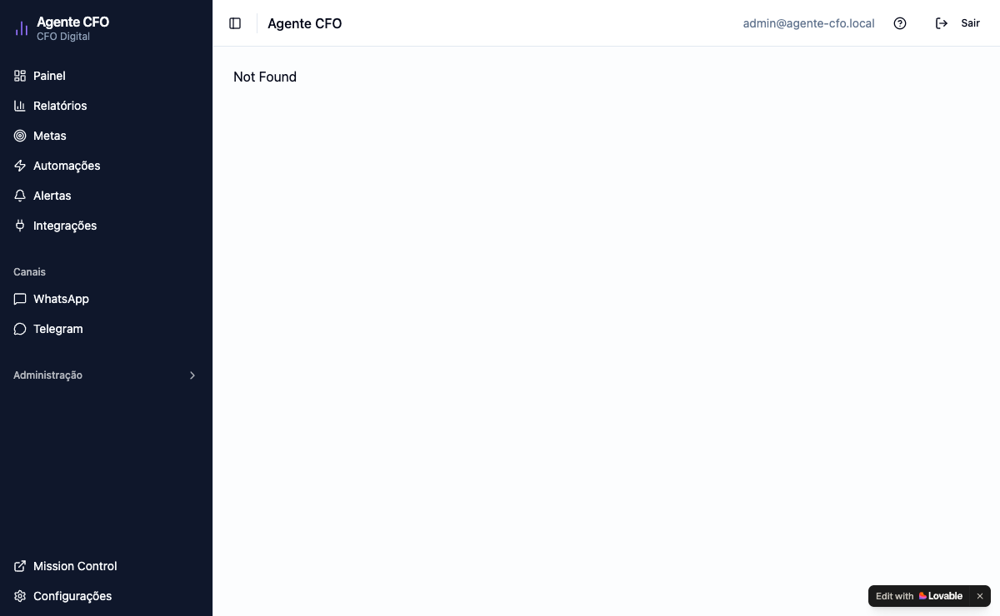
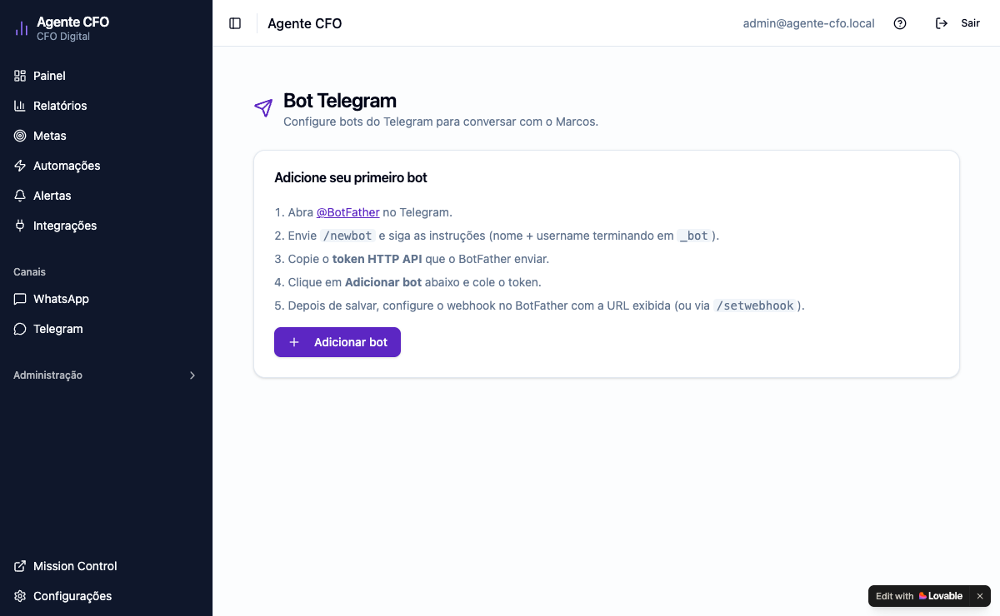
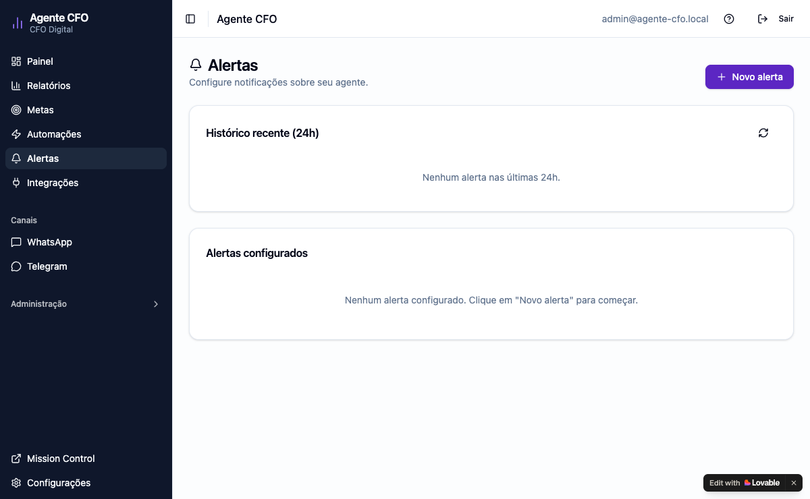

# Marcos — seu CFO virtual 24/7 no WhatsApp

> **Guia leigo, sem firula.** Em 4 etapas e ~15 minutos você tem o Marcos rodando no seu negócio.

---

## O que é o Marcos?

É um **CFO virtual brasileiro** que mora no seu WhatsApp. Você fala com ele em português normal:

- *"Marcos, gastei 50 reais com Uber"* → ele lança no seu ERP automaticamente
- *"Quanto tenho em caixa hoje?"* → ele responde com saldo + projeção
- *"Quem está em atraso?"* → lista os inadimplentes com sugestão de cobrança
- *"Como vamos esse mês?"* → relatório executivo com 3 recomendações concretas

Funciona com **Omie, Bling, Tiny, ContaAzul, HubSpot, Asaas, Mercado Livre** e mais 10 sistemas. Você fala uma vez — ele dispara a ação em todos os sistemas conectados.

---

## Quanto custa?

| Item | Custo médio |
|------|-------------|
| Painel (Lovable Cloud) | Grátis no plano free |
| Banco de dados (Supabase) | Grátis no plano free |
| VPS (Hetzner / DigitalOcean / Hostinger) | R$ 26 – R$ 65/mês |
| API Anthropic (Claude — quem "pensa") | R$ 30 – R$ 150/mês (depende do uso) |
| Código-fonte | **Grátis** (open-source MIT) |
| **Total estimado** | **R$ 60 – R$ 215/mês** |

Sem mensalidade da gente. Sem cadastro. Cada cliente roda na própria infra.

---

## Pré-requisitos (5 minutos)

Antes de começar, tenha em mãos:

1. **Conta Anthropic com créditos** — [console.anthropic.com](https://console.anthropic.com)
   - Crie conta, vá em "API Keys", gere uma `sk-ant-...`
   - Adicione US$ 5–20 de crédito (vai durar bastante)

2. **Um WhatsApp** (qualquer número que você queira usar)

3. **Uma VPS Ubuntu 22.04+** (até 5 minutos pra criar)
   - **Recomendamos Hetzner CX22** (~R$ 26/mês) — [hetzner.com/cloud](https://hetzner.com/cloud)
   - DigitalOcean Basic 2GB (~R$ 65/mês) — [digitalocean.com](https://digitalocean.com)
   - Hostinger VPS 1 (R$ 24/mês) — [hostinger.com.br/vps](https://hostinger.com.br/vps)
   - Specs mínimas: 1 vCPU, 2GB RAM, 20GB disco

4. **(Opcional)** Credencial do seu ERP/CRM/Cobrança — você pode adicionar depois

---

## Etapa 1 — Remixar o painel no Lovable (1 minuto)

O painel é um template Lovable que vira o **seu painel próprio**, no **seu banco isolado**.

1. Abra o link de Remix:  
   👉 **[https://lovable.dev/projects/ddcd382f-f68a-478d-a2a5-811a860ba83c](https://lovable.dev/projects/ddcd382f-f68a-478d-a2a5-811a860ba83c)** *(URL real será fornecida quando o template estiver público)*

2. Clique em **"Remix"**

3. Aguarde ~1 minuto enquanto o Lovable provisiona:
   - Seu projeto novo no workspace
   - Um banco Supabase isolado (só seu)
   - 51 funções de backend (edge functions)
   - Todas as migrações do banco

4. Quando terminar, você terá um painel próprio em:  
   `https://<seu-nome-projeto>.lovable.app`

> 💡 **Importante:** seus dados ficam no SEU Supabase. Ninguém tem acesso — nem nós, nem outros clientes. É *single-tenant* puro.

---

## Etapa 2 — Conhecer a página inicial pública (1 minuto)

A página `/install` do seu painel é uma landing pública com o pitch do Marcos:



Você pode usar essa página pra divulgar o projeto pra sócios/conselho. É só compartilhar o link `https://<seu-painel>.lovable.app/install`.

---

## Etapa 3 — Criar sua conta + onboarding (5 minutos)

### 3.1 Login

Acesse seu painel em `https://<seu-painel>.lovable.app` e você vai cair na tela de login:



1. Digite seu email
2. Clique em "Receber código"
3. O Supabase vai mandar um código de 6 dígitos no seu email
4. Cole o código → **dentro do painel**

> 💡 Não precisa criar senha. O login é só com email + OTP (One-Time Password) — mais seguro e mais simples.

### 3.2 Wizard de Onboarding

Na primeira vez que entrar, você vai pra `/onboarding` — um wizard guiado em 7 passos:



**Passo 1 — Welcome**  
"Olá! Vamos configurar o Marcos em 5 minutos." Botão grande **"Começar →"**.

**Passo 2 — Anthropic API Key**  
Cole sua `sk-ant-...`. Sistema valida em 2s e mostra ✅ ou ❌ com mensagem clara.

**Passo 3 — WhatsApp do dono**  
Número onde o Marcos vai te chamar (formato `+5511999999999`).

**Passo 4 — Escolha sua VPS**  
3 cards com opções de provedor:
- 🇩🇪 **Hetzner** — Mais barata (€4,35/mês ≈ R$ 26)
- 🇺🇸 **DigitalOcean** — Mais conhecida ($12/mês ≈ R$ 65)
- 🇧🇷 **Hostinger** — Opção BR (R$ 24/mês)

Clique em "Criar VPS →" no card escolhido — abre o site do provedor em nova aba.

**O que escolher na hora de comprar:**
- Sistema: **Ubuntu 22.04 LTS** (sempre)
- Plano mais barato (1 vCPU / 2 GB RAM / 20 GB disco)
- Localização: SP/BR se disponível; senão Helsinki ou NYC
- SSH Key OU senha root (anota o que escolher)

Depois de comprar, o provedor te dá um **IP** e **senha/key SSH**. Você vai precisar acessar via terminal.

**Passo 5 — Cole o comando na VPS**  
Esta é a única parte "técnica". Mas é UM comando só:

```bash
curl -fsSL https://<seu-painel>.lovable.app/functions/v1/setup-installer?token=SEU_TOKEN | bash
```

O painel gera o `SEU_TOKEN` único pra você. É só:

1. Copiar o comando (botão **"📋 Copiar"** no painel)
2. Abrir o terminal da VPS (ou SSH: `ssh root@SEU_IP`)
3. Colar e dar Enter

O comando faz TUDO automaticamente em ~5 minutos:
- Instala OpenClaw (o "cérebro" do Marcos)
- Instala 20 skills financeiras (Marcos PhD)
- Conecta 17 integrações ERP/CRM/Cobrança/E-commerce
- Configura WhatsApp via QR (você vai escanear no app)
- Sobe 9 serviços de background
- Registra 5 rotinas automáticas (ronda matinal, vespertina, etc)

**Enquanto roda na VPS, o painel mostra:**
```
🔄 Aguardando Marcos se conectar...
   (leva ~5min após você colar o comando)
```

Quando o Marcos terminar de instalar, o painel **detecta automaticamente** e avança:
```
✅ Marcos online! Avançando...
```

**Passo 6 — Conectar integrações (opcional, pode pular)**  
Cards com cada ERP/CRM/Cobrança suportada. Clique em "Conectar" no que você usa, cole a credencial, teste, salva. **Você pode adicionar depois.**

Plataformas suportadas:
- **ERP:** Omie, Bling, Tiny, Granatum, VHSYS, Nibo, ContaAzul
- **CRM:** HubSpot, RD Station, PipeRun, Pipedrive, Kommo
- **Cobrança:** Asaas, Iugu
- **E-commerce:** Mercado Livre, Nuvemshop

**Passo 7 — Welcome final**  
```
🎉 Pronto! Marcos está online.

O que você quer fazer agora?
[💬 Conversar com Marcos]  [📱 Pareei WhatsApp]  [🔌 Conectar mais]
```

---

## Etapa 4 — Usar o Marcos no dia a dia

### 4.1 Dashboard

`https://<seu-painel>.lovable.app/`



O dashboard mostra:

**🟢 Card de status do Marcos** (topo da página)
- Verde: "Marcos online · última atividade há Xs"
- Amarelo: "Sem sinal há Xm"
- Vermelho: "Offline há Xm — verificar VPS"

**🔄 Feed de Atividade Recente** (logo abaixo)
- Tabs: Tudo | 💬 Chat | 🔄 ERP Sync | ✋ Manual | ⚖️ Conciliação
- Lista os últimos 20 lançamentos com origem + valor + categoria
- Atualiza em tempo real (Supabase Realtime)

**📊 KPIs financeiros** (cards do meio)
- Saldo atual
- A receber (30 dias)
- A pagar (30 dias)
- Inadimplência
- Projeção de caixa 90 dias (gráfico)

**👥 Top inadimplentes** (card)
- Lista os 5 maiores devedores com botão "Marcos: cobrar?"

> 💡 **Banner amarelo** aparece se você tem lançamentos via WhatsApp ainda não migrados pro ERP real: *"1 lançamento pendente — Total R$ 50,00. Configurar ERP →"*

### 4.2 Conversar com o Marcos

**Via WhatsApp (recomendado):**

Mande mensagens normais pro número que você pareou. Exemplos:

```
Você → "Gastei 50 com Uber"
Marcos → "Confirme:
         LANÇAR SAÍDA
         Descrição: Uber
         Valor: R$ 50,00
         Data: 21/05/2026
         Categoria: Transporte
         
         Responda SIM pra confirmar ou NÃO pra cancelar."

Você → "SIM"
Marcos → "✅ Lançado R$ 50,00 em Omie (id 12345), categoria Transporte."
```

**Outras coisas que você pode pedir:**

| Pergunta | O que Marcos faz |
|----------|------------------|
| "Quanto tenho em caixa?" | Lê saldo do ERP, responde com runway estimado |
| "Quais contas vencem essa semana?" | Lista a pagar próximos 7 dias |
| "Quem está atrasado?" | Aging por bucket + sugestão de cobrança |
| "Como vamos esse mês?" | Visão consolidada: caixa + KPIs + 3 recomendações |
| "Devo crescer ou consolidar?" | 3 alternativas com prós/contras + sugestão data-driven |
| "E se eu cortar R$2k de despesa?" | Simulação what-if mês a mês |
| "Próximos vencimentos fiscais" | Calendário DAS/FGTS/IRPJ |

**Via Painel:**

- **`/chat`** — interface de chat web pra falar direto com o Marcos



- **`/canais/inbox`** — todas conversas WhatsApp/Telegram unificadas (estilo WhatsApp Web)



### 4.3 Configurar integrações

`https://<seu-painel>.lovable.app/integrations`



Cada card tem:
- Status (🟢 conectado / 🟡 sem credencial / 🔴 erro)
- Botão **"Conectar"** / **"Editar"** — abre dialog pra colar API key
- Botão **"Testar"** — valida credencial inline (✅/❌)
- Filtro por categoria (ERP / CRM / Cobrança / E-commerce / BD)

### 4.4 Pareamento WhatsApp e Telegram

**WhatsApp** (`/settings/whatsapp`):



**Telegram** (`/settings/telegram`):



Pra Telegram: abra @BotFather no Telegram, digite `/newbot`, escolha nome, pegue o token, cole no painel.

### 4.3 O que o Marcos faz SOZINHO (sem você pedir)

Marcos é **agentic** — ele toma iniciativa:

| Horário | O que faz |
|---------|-----------|
| **06:30** todo dia | Conciliação automática (cruza Asaas↔ERP, ML↔ERP, etc) — só te avisa se houver divergência |
| **07:05** todo dia | Ronda matinal — snapshot do dia anterior, alerta crítico se runway < 7d |
| **18:00** todo dia | Ronda vespertina — anomalias do dia, silencia se nada relevante |
| **Sexta 16:00** | Relatório semanal executivo com 3 recomendações |
| **Dia 1 às 08:00** | Relatório mensal completo (DRE + comparativo MoM) |
| **A cada 5 min** | Puxa lançamentos novos do ERP, registra no painel |
| **Sob demanda** | Detecta credencial inválida e te avisa proativamente |

### 4.5 Alertas customizados

`https://<seu-painel>.lovable.app/alerts`



Vá em `/alerts` e ative templates prontos com 1 clique:

- ⏱️ Runway < 60 dias
- ⚠️ Inadimplência > R$ 10.000
- 🔴 Caixa < 1 burn mensal
- 🔍 Anomalia de despesa (>20% MoM)
- 🧾 Vencimento fiscal (próximos 7 dias)
- 🤝 Deal HubSpot Won há > 30d sem nota fiscal
- 📋 Lançamentos pendentes (dashboard_only)
- 💰 Zero recebimentos em 7 dias

Cada alerta dispara no WhatsApp + painel quando a condição bate.

---

## Como atualizar o Marcos (zero SSH)

Marcos se atualiza sozinho quando você quiser:

**Pelo painel:** Configurações → Sistema → "Atualizar VPS"

**Pelo WhatsApp:** *"Marcos, atualiza você mesmo"*

**Manual (se precisar):**
```bash
ssh root@SEU_IP
bash ~/.openclaw/workspace/skills/agente-cfo/scripts/self_update.sh
```

---

## Problemas comuns

### "Marcos não responde"

1. Veja se o card de status no dashboard mostra 🟢 verde
2. Se 🔴 vermelho: tunnel ou daemon caiu na VPS. Acesse via SSH:
   ```bash
   systemctl status openclaw-gateway
   systemctl restart openclaw-gateway
   ```

### "WhatsApp desconectou"

Pareamento WhatsApp expira de vez em quando. Vá em `/settings/whatsapp` e clique em "Reparear" (mostra QR no painel — sem SSH).

### "Omie retorna erro 404"

Seu plano Omie pode não ter o módulo financeiro habilitado. Marcos faz fallback automático pra `dashboard_only` (registra no painel mesmo sem ERP). Pra ter integração full, troque pra plano com módulo financeiro habilitado.

### "Painel mostra zero em tudo"

Acontece quando o ERP retorna zero (banco vazio ou plano de teste). Veja se há banner amarelo "X lançamentos pendentes" — esses ainda não foram pro ERP real, mas constam no painel.

### Mais ajuda

- 📖 [docs/CLIENTE.md](CLIENTE.md) — guia detalhado
- ❓ [docs/FAQ.md](FAQ.md) — 20+ perguntas frequentes
- 🔧 [docs/TROUBLESHOOTING.md](TROUBLESHOOTING.md) — soluções por sintoma

---

## Custo total de propriedade (1 ano)

Cenário realista de PME que usa Marcos diariamente:

| Item | 12 meses |
|------|----------|
| VPS Hetzner CX22 | R$ 312 |
| Anthropic API (~R$ 80/mês média) | R$ 960 |
| Lovable Cloud free tier | R$ 0 |
| Supabase free tier | R$ 0 |
| **Total ano 1** | **~R$ 1.272** |

Para comparação, contratar um analista financeiro sênior custa R$ 7.000–15.000/mês. O Marcos não é um humano — mas pra rotinas operacionais (lançamento, cobrança, conciliação, relatório) ele resolve o que um analista júnior faria, 24/7, sem pedir folga.

---

## Licença

**MIT** — você é livre pra usar, modificar, redistribuir. Sem royalties, sem cláusulas escondidas.

---

## Próximos passos

1. ✅ Leia este guia até o fim
2. 🔀 Faça o Remix no Lovable
3. 🖥️ Aluga sua VPS (~5 min)
4. ⚙️ Roda o onboarding (~5 min)
5. 💬 Manda "oi" pro Marcos no WhatsApp

**Boa! Você acabou de contratar um CFO sem precisar contratar ninguém.** 🎉
